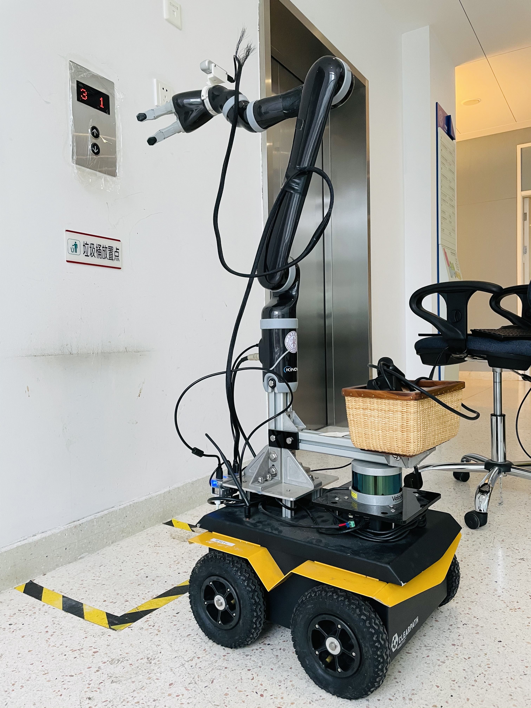
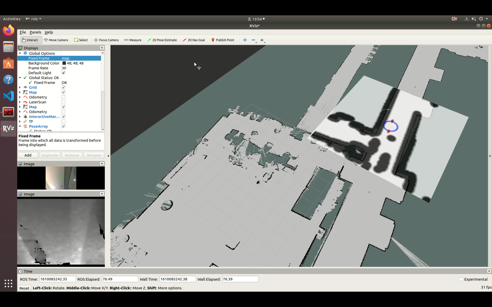
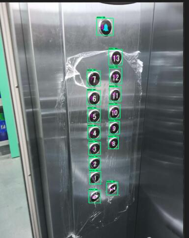
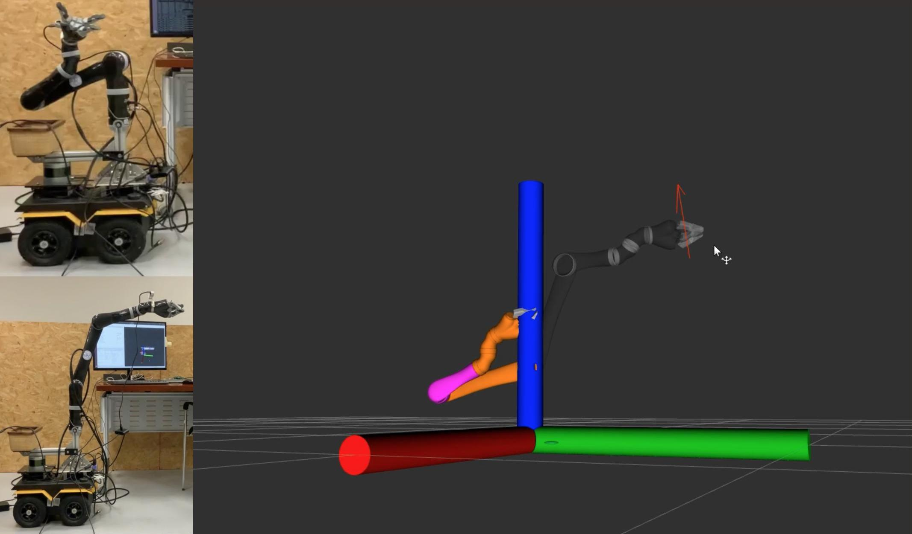

<video style="width:100%" controls>
<source src="resources/elevator.mp4"></video>

## Introduction

In this project, we tried to make a robot capable of taking elevators autonomously. With the ability to take elevators and move vertically inside a building, the mobility of wheeled robots can be significantly improved.

## System Description

### Hardware

Our elevator robot includes a complex hardware system consists of the following parts:

* **Base platform** - Jackal
* **Manipulator** - Kinova
* **Camera** - Intel Realsense
* **3D LiDAR** - Velodyne

<figure>
  
  <figcaption>Fig.1 - The Elevator Robot</figcaption>
</figure>

### Software

The whole software system is a multi-phased pipeline based on ROS melodic on Ubuntu 18.04.

* **Localization and Navigation** - AMCL algorithm

<figure>
  
  <figcaption>Fig.2 - AMCL Navigation</figcaption>
</figure>

* **Button Detection** - OCR-RCNN algorithm

<figure>
  
  <figcaption>Fig.3 - AMCL Navigation</figcaption>
</figure>

* **Button Push** - MoveIt!

<figure>
  
  <figcaption>Fig.4 - Button Push</figcaption>
</figure>

The upper left image indicates a random starting pose of the manipulator, represented by the orange arm in RViz in the right.

The lower left image indicates the target pose of the manipulator where it pushes the button with the pose represented by the red arrow in RViz in the right.
