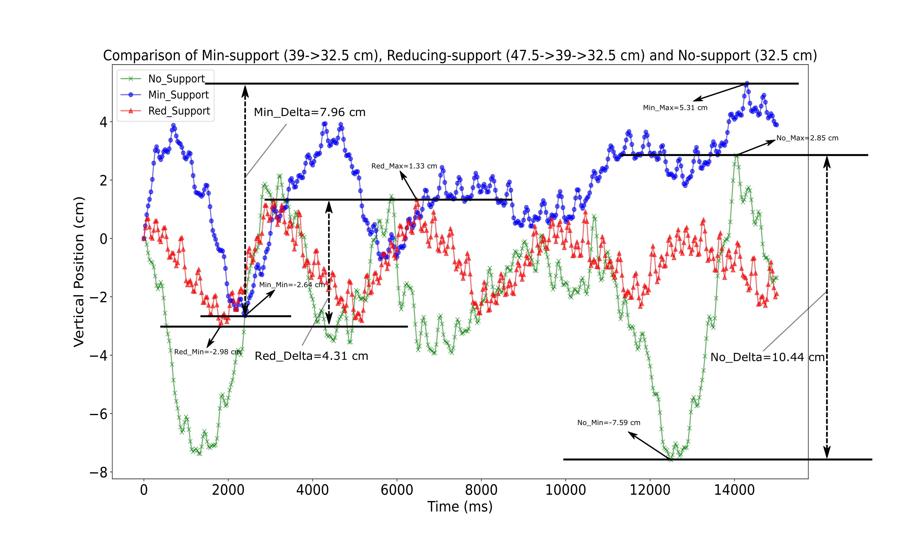

**Publication** [[**Springer**](https://link.springer.com/chapter/10.1007/978-3-030-95892-3_28)][[**arXiv**](https://arxiv.org/abs/2101.09961)][[**code**](https://github.com/keyanzhai/Slimdog)][[**slides**](https://1drv.ms/p/s!AuXcCtfGaQlXg7QnW-4KvFFFTjsgGg?e=eXJ6RU)]: 
Keyan Zhai, Chu'an Li, and Andre Rosendo. "Scaffolded Learning of In-place Trotting Gait for a Quadruped Robot with Bayesian Optimization." 16th International Conference on Intelligent Autonomous Systems ([IAS-16](https://www.ias-16.com/)).

**Abstract**
During learning trials, systems are exposed to different failure conditions which may break robotic parts before a safe behavior is discovered. Humans contour this problem by grounding their learning to a safer structure/control first and gradually increasing its difficulty. This paper presents the impact of a similar supports in the learning of a stable gait on a quadruped robot. Based on the psychological theory of instructional scaffolding, we provide different support settings to our robot, evaluated with strain gauges, and use Bayesian Optimization to conduct a parametric search towards a stable Raibert controller. We perform several experiments to measure the relation between constant supports and gradually reduced supports during gait learning, and our results show that a gradually reduced support is capable of creating a more stable gait than a support at a fixed height. Although gaps between simulation and reality can lead robots to catastrophic failures, our proposed method combines speed and safety when learning a new behavior.

## Motivation

<video style="width:100%" controls>
<source src="resources/failures.mp4"></video>

## Experiments

<figure>
  
  <figcaption>Fig.1 - The Slimdog robot</figcaption>
</figure>

<figure>
  
  <figcaption>Fig.2 - Comparison of no support, minimum support and reducing support</figcaption>
</figure>

## Kinovea Analysis

### No support (No_P1, 1st run, fitness = 72.83)

<video style="width:100%" controls>
<source src="resources/No_P1_R1_Kinovea3.mp4"></video>

### Minimum support (Min_P1, 1st run, fitness = 72.43)

<video style="width:100%" controls>
<source src="resources/Min_P1_R1_Kinovea3.mp4"></video>

### Reducing support (Red_P1, 3rd run, fitness = 75.92)

<video style="width:100%" controls>
<source src="resources/Red_P1_R3_Kinovea3.mp4"></video>

## Results

### Knee and joint angles

<figure>
  
  <figcaption>Fig.3 - Knee and joint angles</figcaption>
</figure>

### Vertical translation of center of mass

<figure>
  
  <figcaption>Fig.4 - Vertical translation of center of mass</figcaption>
</figure>
